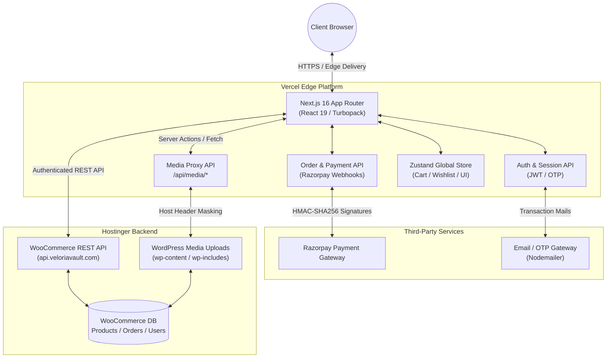

# Veloria Vault — Luxury Headless E-Commerce Platform

<div align="center">

[](https://nextjs.org/)
[](https://react.dev/)
[](https://tailwindcss.com/)
[](https://woocommerce.com/)
[](https://razorpay.com/)
[](https://www.typescriptlang.org/)
[](https://veloriavault.com)

**A high-performance, ultra-luxury headless e-commerce storefront engineered with Next.js 16 (App Router & Turbopack), React 19, and WooCommerce REST API.**

[Live Storefront](https://www.veloriavault.com) • [API Backend](https://api.veloriavault.com) • [Report Issue](https://github.com/ak1458/veloriavault-headless-v1/issues)

</div>

---

## 💎 Overview

**Veloria Vault** is a state-of-the-art decoupled e-commerce architecture designed to deliver sub-second page loads, an immersive editorial shopping experience, and rock-solid conversion funnels. 

By separating the high-traffic frontend on **Vercel Edge Network** from the WordPress/WooCommerce administrative backend on **Hostinger**, the platform achieves peak security, infinite scalability, and fluid 60fps micro-animations.

---

## ✨ Key Capabilities & Features

### 🛍️ Storefront & User Experience
* **Editorial Aesthetic**: Curated color palette, serif/sans typography pairing, responsive glassmorphism navigation, and announcement ticker.
* **Instant Interactive Drawer**: Global Zustand-powered cart drawer with slide-out animation, auto-open triggers, live item calculations, and direct checkout link.
* **Product Variations & Swatches**: Real-time attribute switching, image carousel sync, stock status badges, and breadcrumb categorization.
* **Dynamic Wishlist**: Persistent wishlist with local storage synchronization, heart toggles, and direct add-to-cart migration.
* **Gamified Rewards**: Interactive **Spin-the-Wheel** & **Scratch Card** modules for real-time coupon code generation and conversion boosts.

### 💰 Tiered Discount & Promotion Engine
* **Automatic Tier Discounts**: 
  * 1 Item = **15% Off**
  * 2+ Items = **20% Off**
* **Prepaid Incentive**: Extra **5% Off** automatically applied upon selecting UPI / Cards over Cash on Delivery.
* **Algorithmic 35% Discount Cap**: Mathematical safeguard preventing discount stacking from exceeding the 35% margin threshold.

### 💳 Checkout & Payments
* **Razorpay Official Integration**: Seamless modal checkout supporting UPI, Credit/Debit Cards, Net Banking, and Wallets.
* **Cash on Delivery (COD)**: Configurable convenience fee handling with real-time savings prompts encouraging prepaid conversion.
* **Coupon Validation API**: Instant server-side verification against WooCommerce coupon rules.
* **Server-Side Security**: Tamper-proof signature verification (`HMAC-SHA256`) and webhook callbacks to eliminate client-side manipulation.

### 📦 Order Management & Post-Purchase Hub
* **Guest & Account Order Tracking**: Real-time tracking via Mobile Number or Order ID without requiring forced account login.
* **Instant Cancellation & Refunds**: Automated single-click cancellation for eligible orders with direct Razorpay refund API dispatch.
* **Hassle-Free Returns**: Self-service return initiation with reason selection and status updates.
* **Automated PDF Invoice Generation**: Dynamic branded GST invoices generated server-side using `pdf-lib`.

### 🔐 Authentication & Customer Accounts
* **Passwordless OTP Login**: SMS-based One-Time Password verification via Nodemailer / SMS gateways.
* **JWT Session Tokens**: Secure HttpOnly cookie session management with role-based routing.
* **Customer Dashboard**: Historical order summaries, delivery timelines, address book, and profile settings.

### 🚀 Media & Security Architecture
* **Intelligent Media Proxy (`/api/media/[...path]`)**: High-speed reverse proxy routing media assets through host-header masking to bypass firewall locks and cache static assets.
* **Strict CSP & Security Headers**: Protection against XSS, clickjacking, MIME-sniffing, and frame injection via configured headers.

---

## 🏛️ System Architecture



---

## 🛠️ Technology Stack

| Layer | Technologies |
|---|---|
| **Framework** | [Next.js 16.3.2](https://nextjs.org/) (App Router, Turbopack, Server Components) |
| **UI Library** | [React 19.2.8](https://react.dev/) |
| **Styling** | [Tailwind CSS v4](https://tailwindcss.com/), Custom Design System Tokens, CSS Modules |
| **Animation** | [Framer Motion 12](https://www.framer.com/motion/), [GSAP 3.15](https://greensock.com/gsap/) |
| **State Management** | [Zustand 5.0.15](https://github.com/pmndrs/zustand) |
| **Forms & Validation** | [React Hook Form 7.86](https://react-hook-form.com/), [Zod 4.4.3](https://zod.dev/) |
| **Icons** | [Lucide React](https://lucide.dev/) |
| **Document Generation** | [pdf-lib 1.17](https://pdf-lib.js.org/) |
| **Authentication** | [NextAuth.js 4.24](https://next-auth.js.org/), [jsonwebtoken](https://github.com/auth0/node-jsonwebtoken), [bcryptjs](https://github.com/dcodeIO/bcrypt.js) |
| **Payments** | [Razorpay Node SDK](https://razorpay.com/docs/payments/server-integration/nodejs/) |
| **Testing** | [Vitest](https://vitest.dev/) |
| **Deployment** | [Vercel](https://vercel.com/) |

---

## 📂 Project Structure

```
veloria-vault/
├── public/                 # Static assets, logos, and icons
├── src/
│   ├── app/                # Next.js App Router routes & API endpoints
│   │   ├── (pages)/        # Static legal & information pages
│   │   ├── account/        # User profile, history & return workflows
│   │   ├── api/            # Serverless API routes
│   │   │   ├── auth/       # OTP, login, logout, register endpoints
│   │   │   ├── checkout/   # Order processing & payment verification
│   │   │   ├── coupons/    # Dynamic coupon evaluation
│   │   │   ├── media/      # Reverse media proxy for WordPress assets
│   │   │   ├── orders/     # Order tracking, returns, cancellation & invoices
│   │   │   └── razorpay/   # Webhook handlers & order creation
│   │   ├── cart/           # Dedicated cart page
│   │   ├── checkout/       # Multi-step luxury checkout flow
│   │   ├── product/        # Dynamic product detail page [slug]
│   │   ├── product-category/# Category archive page [slug]
│   │   ├── shop/           # Catalog browsing & faceted filtering
│   │   ├── track-order/    # Live order tracking interface
│   │   ├── wishlist/       # Customer wishlist interface
│   │   ├── layout.tsx      # Root layout, metadata & global providers
│   │   └── page.tsx        # Homepage with hero, grids, & hot sellers
│   ├── components/         # Reusable presentation & interactive components
│   │   ├── CartDrawer.tsx  # Slide-out global cart drawer
│   │   ├── PremiumHeader.tsx # Top ticker, search, mobile menu & navigation
│   │   ├── ProductCard.tsx # Editorial product showcase card
│   │   ├── SpinWheel.tsx   # Gamified coupon wheel reward
│   │   └── ...
│   ├── config/             # Business logic rules, promos & store constants
│   ├── lib/                # Core utilities, WooCommerce API clients & calculations
│   ├── store/              # Zustand global state slices (cart, wishlist, UI)
│   └── types/              # TypeScript schemas & API data contracts
├── next.config.ts          # Next.js compiler, CSP headers, rewrites & image domains
├── package.json            # Project dependencies & scripts
├── tsconfig.json           # TypeScript strict configuration
└── vercel.json             # Vercel security headers, caching & redirects
```

---

## 🚦 Getting Started

### Prerequisites
* **Node.js**: `v20.x` or higher (Node 22 LTS recommended)
* **Package Manager**: `npm` (v10+)
* **WooCommerce Store**: WordPress instance with REST API keys enabled.

### 1. Clone & Install

```bash
# Clone the repository
git clone https://github.com/ak1458/veloriavault-headless-v1.git
cd veloriavault-headless-v1

# Install exact dependencies
npm install
```

### 2. Configure Environment Variables

Create a `.env.local` file in the root directory:

```env
# ==========================================
# SITE & CANONICAL
# ==========================================
NEXT_PUBLIC_SITE_URL="https://www.veloriavault.com"

# ==========================================
# WOOCOMMERCE BACKEND
# ==========================================
NEXT_PUBLIC_WOOCOMMERCE_URL="https://api.veloriavault.com"
WOOCOMMERCE_CONSUMER_KEY="ck_xxxxxxxxxxxxxxxxxxxxxxxxxxxxxxxxxxxxxxxx"
WOOCOMMERCE_CONSUMER_SECRET="cs_xxxxxxxxxxxxxxxxxxxxxxxxxxxxxxxxxxxxxxxx"

# ==========================================
# RAZORPAY PAYMENT GATEWAY
# ==========================================
NEXT_PUBLIC_RAZORPAY_KEY_ID="rzp_live_xxxxxxxxxxxxxx"
RAZORPAY_KEY_SECRET="xxxxxxxxxxxxxxxxxxxxxxxx"
RAZORPAY_WEBHOOK_SECRET="xxxxxxxxxxxxxxxxxxxxxxxx"

# ==========================================
# AUTHENTICATION & SECURITY
# ==========================================
NEXTAUTH_SECRET="your-super-secret-jwt-signing-key"
NEXTAUTH_URL="https://www.veloriavault.com"

# ==========================================
# EMAIL / SMTP (OTP & INVOICES)
# ==========================================
SMTP_HOST="smtp.hostinger.com"
SMTP_PORT="465"
SMTP_USER="orders@veloriavault.com"
SMTP_PASS="your-smtp-password"
SMTP_FROM="Veloria Vault <orders@veloriavault.com>"
```

### 3. Run Development Server

```bash
npm run dev
```

Open [http://localhost:3000](http://localhost:3000) to view the development build with Turbopack.

---

## 📜 Available Scripts

| Command | Action |
|---|---|
| `npm run dev` | Starts local Next.js dev server with Turbopack |
| `npm run build` | Compiles optimized production build with static generation |
| `npm run start` | Launches Node.js production server |
| `npm run lint` | Runs ESLint 9 checks across all source files |
| `npm run test` | Executes unit test suite via Vitest |
| `npm run test:watch` | Runs Vitest in interactive watch mode |

---

## 🛡️ Production & Security Best Practices

1. **Payment Amount Authority**: Client-side prices are never trusted. All final charge amounts are calculated and verified server-side against WooCommerce before invoking Razorpay order creation.
2. **Media Proxy Validation**: Path traversal protections and sanitized URI decoding prevent unauthorized file extraction.
3. **Environment Segregation**: Sensitive keys (`RAZORPAY_KEY_SECRET`, `WOOCOMMERCE_CONSUMER_SECRET`, `NEXTAUTH_SECRET`) are never prefixed with `NEXT_PUBLIC_` to keep them outside the client bundle.
4. **Strict CSP & Cache-Control**: Dynamic API endpoints are served with `Cache-Control: no-store, max-age=0` to protect customer PII and real-time inventory.

---

## 📄 License

This project is proprietary and protected under the **MIT License**. See [LICENSE](LICENSE) for details.

---

<div align="center">

Crafted with excellence for **Veloria Vault** • Engineered for luxury commerce.

</div>
